# CNSS Recruit 2022 Reverse Writeup

为什么现在才发出来，因为去年之后就一直忘了，直到今年夏令营开了才想起来去年还写过这个，就权当发出来记录一下吧。

大二上零re基础肝了一个月，确实是啥也不会，cnss里全都是大佬，萌新瑟瑟发抖。

果然因为基础知识太差加上学习不用心最后还是挂了，不过确实是一次有趣而难忘的体验。

## [Baby] Find me

根据提示，打开strings窗口，发现第一段flag和最后一段flag。


在函数窗口里找到第二段flag，（感觉挺阴间的，找了半天各种搜flag，谁知道竟然直接把flag的内容当函数名啊！）

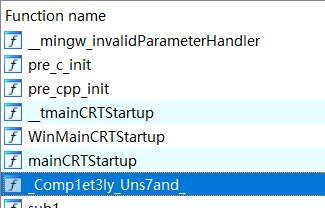

第三段根据提示点开`Find out which function refer to me!`，对其按x找到引用，上面写的就是第三段flag：


## [Easy] 回レ! 雪月花

（这里是后面分析的，最开始嫌分析麻烦就直接顺着逻辑用约束求解器做的）

分析得到这是通过对一段字符进行异或和移位操作，于是反向过来得到flag：

```c
#include <stdio.h>
unsigned char cipher[40] = {0x3F, 0x8F, 0xA3, 0xBC, 0x8D, 0x27, 0x7A, 0x67, 0xE2, 0x3,
          0xA2, 0xE0, 0xAC, 0xEA, 0x95, 0x8B, 0xA3, 0xED, 0xCC,
          0xB6, 0x32, 0x8C, 0x94, 0x52, 0x82, 0x8A, 0x14, 0xC6, 0xF5, 0xAE, 0x68, 0x73};
int main() {
    
    for ( int i = 28; i >= 0; --i ){
        unsigned char v1,v2,v3,v4;
        v1 = (cipher[i] >> 7) | ((cipher[i+2] ^ cipher[i+1]) << 1);
        v2 = (cipher[i] << 1) | ((cipher[i+2] ^ cipher[i+1]) >> 7);
        v3 = ((cipher[i+1] ^ cipher[i]) >> 6) | ((cipher[i+3] ^ cipher[i+2]) << 2);
        v4 = ((cipher[i+1] ^ cipher[i]) << 2) | ((cipher[i+3] ^ cipher[i+2]) >> 6);

        cipher[i] = v1;
        cipher[i+1] = v2;
        cipher[i+2] = v3;
        cipher[i+3] = v4;
    }
    for (int  j = 0;  j <= 31 ; ++ j) {
        cipher[j] ^= 0x11;
    }
    printf("%s", cipher);
    return 0;
}
```

对于这种计算量不是特别大的情况，懒得分析就直接用约束求解器（类似于一个解方程的计算器）来算，直接按照原逻辑写一遍，然后最后把判等条件传给求解器即可解出。这个我写的过程出现了一些问题导致无法求解，即python里没有严格的类型来限制数据的位数，导致向左移位时最高位不会被舍去，所以要通过和0xff进行与运算来舍去8位以上的位。

使用python里的一个约束求解器`z3py`（夏令营学到的）

```python
from z3 import *
b = 0x11

cipher = [0x3F, 0x8F, 0xA3, 0xBC, 0x8D, 0x27, 0x7A, 0x67, 0xE2, 0x3,
          0xA2, 0xE0, 0xAC, 0xEA, 0x95, 0x8B, 0xA3, 0xED, 0xCC,
          0xB6, 0x32, 0x8C, 0x94, 0x52, 0x82, 0x8A, 0x14, 0xC6, 0xF5, 0xAE, 0x68, 0x73]
flag = cipher

thef = [z3.BitVec(f'x{i}', 32) for i in range(32)]
s = Solver()
#
for i in range(32):
    thef[i] ^= 0x11
    thef[i] &= 0xff

for i in range(29):
    v5 = ((thef[i] << 7) | (thef[i + 1] >> 1)) & 0xff
    v6 = (((thef[i + 3] >> 2) | (thef[i + 2] << 6)) ^ v5) & 0xff
    v7 = (((thef[i] >> 1) | (thef[i + 1] << 7)) ^ v6) & 0xff
    v8 = (((thef[i + 2] >> 2) | (thef[i + 3] << 6)) ^ v7) & 0xff
    thef[i] = v5
    thef[i + 1] = v6
    thef[i + 2] = v7
    thef[i + 3] = v8

for i in range(32):
    s.add(thef[i] == cipher[i])

if s.check() == sat:
    print(s.model())
```

## [Easy] 邪王真眼

ida打开发现了一串字符串`abcd4EFGHij8k0lMNOPqr6stU91VWXyz7+/ABCDefg2hI5JKLmnopQRST3uvwxYZ`。一眼丁真鉴定为：base64的字母表，然后再找strings找到密文：`UR3oWS5E0G03tRibWRrR0cEx`

用一个自定义字母表的base64解密函数即可得到flag：

```python
letters = "abcd4EFGHij8k0lMNOPqr6stU91VWXyz7+/ABCDefg2hI5JKLmnopQRST3uvwxYZ"

#定义base64加密函数
def encryption(inputString):
    # 对每一个字节取ascii数值或unicode数值，然后转换为2进制
    ascii = ['{:0>8}'.format(str(bin(ord(i))).replace('0b', ''))
             for i in inputString]
    #返回的加密文本
    outputString = ''
    # 不够3字节的整数倍，需要补齐“=”的个数
    equalNumber = 0
    #对每个字符的转换
    while ascii:
        #三个asciiw为一组
        AsciiList = ascii[:3]
        if len(AsciiList) != 3:
            #不满三个的，在后面加“=”
            while len(AsciiList) < 3:
                equalNumber += 1
                AsciiList += ['0'*8]
        #join方法连接成三个8字节的字符串
        tempString = ''.join(AsciiList)
        # 三个8字节的二进制，转换为4个6字节的二进制
        tempStringList = [tempString[x:x+6] for x in [0, 6, 12, 18]]
        # 二进制转为10进制
        tempStringList = [int(x, 2) for x in tempStringList]
        # 判断是否需要补“=”,只要equakNumber大于0即需要
        if equalNumber:
            tempStringList = tempStringList[0:4-equalNumber]
        #装换成那64个字符
        outputString += ''.join([letters[x] for x in tempStringList])
        ascii = ascii[3:]
    #在最后加上“=”
    outputString = outputString + '=' * equalNumber
    #返回加密后的文本
    return outputString

#定义base64解密函数
def decryption(inputString):
    # 对前面不是“=”的字节取索引，然后转换为2进制
    asciiList = ['{:0>6}'.format(str(bin(letters.index(i))).replace('0b', ''))
                      for i in inputString if i != '=']
    outputString = ''
    #补齐“=”的个数
    equalNumber = inputString.count('=')
    while asciiList:
        tempList = asciiList[:4]
        #转换成2进制字符串
        tempString = ''.join(tempList)
        # 对没有8位2进制的字符串补够8位2进制
        if len(tempString) % 8 != 0:
            tempString = tempString[0:-1*equalNumber*2]
        # 4个6字节的二进制  转换  为三个8字节的二进制
        tempStringList = [tempString[x:x+8] for x in [0, 8, 16]]
        # 二进制转为10进制
        tempStringList = [int(x, 2) for x in tempStringList if x]
        #连接成字符串
        outputString += ''.join([chr(x) for x in tempStringList])
        asciiList = asciiList[4:]
    #print(output_str)
    return outputString

flag = 'cnss{xxxx}'
#加密
encryptedText = encryption(flag)
print("加密文本为："+encryptedText)
#解密
decryptedText = decryption("UR3oWS5E0G03tRibWRrR0cEx")
print("解密文本为："+decryptedText)
```

## [Easy] 恭喜你获得了flag提现机会！

发现使用了一个永远减不到0的函数，而只有v6到了0才会打印flag。

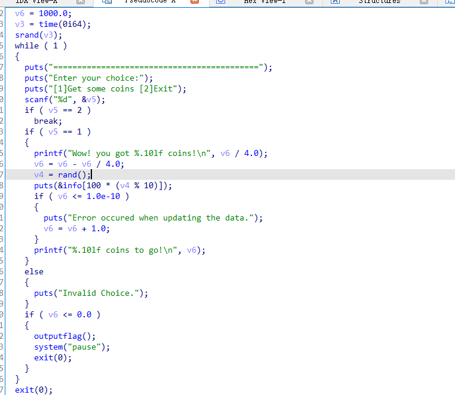

使用ida的`Patch Program`功能，因为发现输出flag就是使用了一个`outputflag`函数，所以直接跳过前面的条件判断调用这个函数就行。在最前面的地方，修改汇编代码为`call outputflag`：

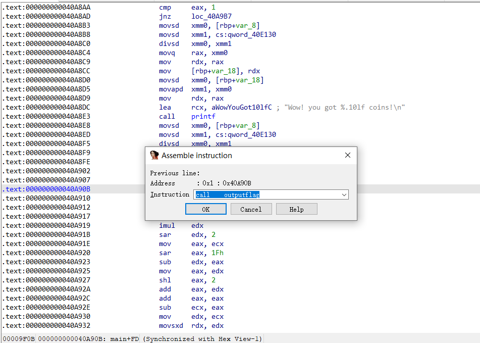

可以看到在伪代码里已经是直接调用函数了。保存修改打开原exe文件即可得到flag。


## [Easy+] diannaobaozhale

这是一个读汇编源码的题，先看源码：

```assembly
main            proc near

var_5           = byte ptr -5
var_4           = dword ptr -4

; __unwind {
        endbr64
        push    rbp
        mov     rbp, rsp
        sub     rsp, 10h
        mov     [rbp+var_5], 63h
        mov     edi, 63h
        call    _putchar
        mov     edi, 6Eh
        call    _putchar
        mov     edi, 73h
        call    _putchar
        mov     edi, 73h
        call    _putchar
        mov     edi, 7Bh
        call    _putchar
        mov     [rbp+var_4], 0
        jmp     short loc_11B0
loc_1194:
        movsx   eax, [rbp+var_5]
        mov     edi, eax
        call    _putchar
        movzx   eax, [rbp+var_5]
        add     eax, 2
        xor     eax, 1
        mov     [rbp+var_5], al
        add     [rbp+var_4], 1
loc_11B0:
        cmp     [rbp+var_4], 9
        jle     short loc_1194
        mov     edi, 7Dh
        call    _putchar
        mov     eax, 0
        leave
        retn
; }
main            endp
```

发现在`loc_11B0`中在循环调用`loc_1194`，而这个函数的操作就是对eax寄存器的指进行加2和对1异或。知道`edi`寄存器的值可以作为函数的第一个参数使用，根据这个调用putchar。

写出对应的c语言代码即可：

```c
#include <stdio.h>

int main() {
    char c[20] = {0x63, 0x6E, 0x73, 0x73, 0x7B};
    char ax = 0x63;
    int i = 0;
   
    printf("%s", c); 
    while(i <= 9) {
        putchar(ax);
        ax += 2;
        ax ^= 1;
        i ++;
    }
    putchar(0x7D);
    putchar('\n');
    return 0;
}
```

## [Easy+] Tell me your secret

ida打开发现了一堆if的判断语句，只要flag对应的不满足这个等式条件就返回wrong，所以需要顺着这一堆条件来写。首先对直接进行比较的部分进行直接赋值：

```c
	char v4[40];
    char *flag = v4;
    *(long *)flag = 0x6461626235363936;
    *((int *)flag + 2) = 892494177;
    *((short *)flag + 6) = 26209;
    *((short *)flag + 7) = 25906;
```

然后发现后面使用一个函数对flag进行了处理再比较，点开这个函数：

```c
long sub_401629(long a1, int a2)
{
  long v3; // [rsp+10h] [rbp-10h]
  int v4; // [rsp+1Ch] [rbp-4h]

  v4 = 0;
  v3 = 0L;
  while ( v4 < a2 )
    v3 = (v3 << 8) + *(char *)(v4++ + a1);
  return v3;
}

```

发现这个函数就是以字节为单位进行一个倒置，所以直接写出对应比较的16进制倒置数据：

```c
	flag += 16;
    // 原数据0x3233383136633364
    *(long *)flag = 0x6433633631383332;
    // 原数据0x39313934
    *((int *)flag + 2) = 0x34393139;
    // 原数据0x3330
    *((short *)flag + 6) = 0x3033;
    // 原数据0x3163
    *((short *)flag + 7) = 0x6331;
    flag -= 16;
    printf("%s \n", flag);
    return 0;
```

##  [Middle] Vip of Mihoyo

虚拟机逆向，指的是自己实现一套指令系统，然后在此基础上运行字节码。于是ida反编译一下，先得到对应的opcode，然后反向每个指令的操作，从opcode末尾来逆向运行即可得出flag。

```c
int opcode[] = {
        7, 0, 2, 8, 3, 0x0E, 1, 0x0A, 5, 0x80, 6, 0x394, 7, 1, 2,
        8, 3, 0x0E, 1, 0x0A, 5, 0x80, 6, 0x3EC, 7, 2, 2, 8,
        3, 0x0E, 1, 0x0A, 5, 0x80, 6, 0x314, 7, 3, 2, 8, 3, 0x0E,
        1, 0x0A, 5, 0x80, 6, 0x314, 7, 4, 2, 8, 3, 0x0E, 1, 0x0A,
        5, 0x80, 6, 0x354, 7, 5, 2, 8, 3, 0x0E, 1, 0x0A, 5, 0x80,
        6, 0x2AC, 7, 6, 2, 8, 3, 0x0E, 1, 0x0A, 5, 0x80, 6, 0x33C,
        7, 7, 2, 8, 3, 0x0E, 1, 0x0A, 5, 0x80, 6, 0x1CC, 7,
        8, 2, 8, 3, 0x0E, 1, 0x0A, 5, 0x80, 6, 0x3D4, 7, 9, 2, 8,
        3, 0x0E, 1, 0x0A, 5, 0x80, 6, 0x274, 7, 0x0A, 2, 8, 3, 0x0E,
        1, 0x0A, 5, 0x80, 6, 0x22C, 7, 0x0B, 2, 8, 3, 0x0E, 1, 0x0A,
        5, 0x80, 6, 0x3E4, 7, 0x0C, 2, 8, 3, 0x0E, 1, 0x0A, 5, 0x80,
        6, 0x274, 7, 0x0D, 2, 8, 3, 0x0E, 1, 0x0A, 5, 0x80, 6, 0x124,
        7, 0x0E, 2, 8, 3, 0x0E, 1, 0x0A, 5, 0x80, 6, 0x31C, 7, 0x0F,
        2, 8, 3, 0x0E, 1, 0x0A, 5, 0x80, 6, 0x30C, 7, 0x10, 2, 8,
        3, 0x0E, 1, 0x0A, 5, 0x80, 6, 0x224, 7, 0x11, 2, 8, 3, 0x0E,
        1, 0x0A, 5, 0x80, 6, 0x394, 7, 0x12, 2, 8, 3, 0x0E, 1, 0x0A,
        5, 0x80, 6, 0x31C, 7, 0x13, 2, 8, 3, 0x0E, 1, 0x0A, 5, 0x80,
        6, 0x20C, 7, 0x14, 2, 8, 3, 0x0E, 1, 0x0A, 5, 0x80, 6, 0x324,
        7, 0x15, 2, 8, 3, 0x0E, 1, 0x0A, 5, 0x80, 6, 0x114, 7, 0x16,
        2, 8, 3, 0x0E, 1, 0x0A, 5, 0x80, 6, 0x184, 7, 0x17, 2, 8,
        3, 0x0E, 1, 0x0A, 5, 0x80, 6, 0x364
        };
    char v2[30];
    int i = 287;
    int v5;
    int v3;
    while (i >= 0 )
    {   
        v3 = opcode[i];
        switch (opcode[i - 1])
        {
        case 1:
            v5 -= v3;
            goto LABEL_16;
        case 2:
            v5 /= v3;
            goto LABEL_16;
        case 3:
            v5 += v3;
            goto LABEL_16;
        case 4:
            v5 *= v3;
            goto LABEL_16;
        case 5:
            v5 ^= v3;
            goto LABEL_16;
        case 6:
            v5 = v3;
            goto LABEL_16;
        case 7:
            v2[v3] = v5;
            // printf("%c: %d \n", v5, v3);
            goto LABEL_16;
        case 8:
            v5 = v2[v3];
            goto LABEL_16;
        default:
        LABEL_16:
            i -= 2;
            continue;
        }
    }
    
    for(int n = 0;n < 25; n++) {
        printf("%c", v2[n]);
    }
    return 0;
```

## [Middle] Super Mario Code

搜索理解SMC是指Self Modifying Code，即自修改代码。打开ida发现main函数部分是一堆无法识别的数据：


查看SMC函数和TEA函数发现这是在程序运行过程中动态修改程序指令，于是用ida的linux动调，在服务器打开一个linux server，然后在main函数运行的第一步下断点：

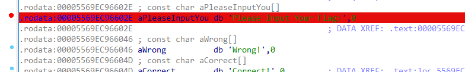

一路跳步直到main那一段全部变成汇编：

```assembly
main db 0F3h, 0Fh                       ; DATA XREF: _start+21↑o
.text:000055FBE232836E                                         ; SMC(void)+C↑o
.text:000055FBE232836E db 0F3h
.text:000055FBE232836E main endp
.text:000055FBE232836E
.text:000055FBE232836E ; ---------------------------------------------------------------------------
.text:000055FBE2328370 db  1Eh
.text:000055FBE2328371 db 0FAh
.text:000055FBE2328372 ; ---------------------------------------------------------------------------
.text:000055FBE2328372 push    rbp
.text:000055FBE2328373 mov     rbp, rsp
.text:000055FBE2328376 sub     rsp, 90h
.text:000055FBE232837D mov     [rbp-84h], edi
.text:000055FBE2328383 mov     [rbp-90h], rsi
.text:000055FBE232838A mov     qword ptr [rbp-50h], 0
.text:000055FBE2328392 mov     qword ptr [rbp-48h], 0
.text:000055FBE232839A mov     qword ptr [rbp-40h], 0
.text:000055FBE23283A2 mov     qword ptr [rbp-38h], 0
.text:000055FBE23283AA mov     qword ptr [rbp-30h], 0
.text:000055FBE23283B2 mov     qword ptr [rbp-28h], 0
.text:000055FBE23283BA mov     qword ptr [rbp-20h], 0
.text:000055FBE23283C2 mov     qword ptr [rbp-18h], 0
.text:000055FBE23283CA lea     rdi, aPleaseInputYou            ; "Please Input Your Flag:"
.text:000055FBE23283D1 call    _puts
.text:000055FBE23283D6 mov     rax, 200E103830302D20h
.text:000055FBE23283E0 mov     rdx, 3A3072261C30721Ch
.text:000055FBE23283EA mov     [rbp-80h], rax
.text:000055FBE23283EE mov     [rbp-78h], rdx
.text:000055FBE23283F2 mov     rax, 372231242D732062h
.text:000055FBE23283FC mov     rdx, 302D2C7237222F36h
.text:000055FBE2328406 mov     [rbp-70h], rax
.text:000055FBE232840A mov     [rbp-68h], rdx
.text:000055FBE232840E mov     word ptr [rbp-60h], 3E62h
.text:000055FBE2328414 mov     byte ptr [rbp-5Eh], 0
.text:000055FBE2328418 lea     rax, [rbp-50h]
.text:000055FBE232841C mov     edx, 22h ; '"'
.text:000055FBE2328421 mov     rsi, rax
.text:000055FBE2328424 mov     edi, 0
.text:000055FBE2328429 call    _read
.text:000055FBE232842E mov     dword ptr [rbp-4], 0
.text:000055FBE2328435
.text:000055FBE2328435 loc_55FBE2328435:                       ; CODE XREF: .text:000055FBE2328457↓j
.text:000055FBE2328435 cmp     dword ptr [rbp-4], 21h ; '!'
.text:000055FBE2328439 jg      short loc_55FBE2328459
.text:000055FBE232843B mov     eax, [rbp-4]
.text:000055FBE232843E cdqe
.text:000055FBE2328440 movzx   eax, byte ptr [rbp+rax-50h]
.text:000055FBE2328445 xor     eax, 43h
.text:000055FBE2328448 mov     edx, eax
.text:000055FBE232844A mov     eax, [rbp-4]
.text:000055FBE232844D cdqe
.text:000055FBE232844F mov     [rbp+rax-50h], dl
.text:000055FBE2328453 add     dword ptr [rbp-4], 1
.text:000055FBE2328457 jmp     short loc_55FBE2328435
.text:000055FBE2328459 ; ---------------------------------------------------------------------------
.text:000055FBE2328459
.text:000055FBE2328459 loc_55FBE2328459:                       ; CODE XREF: .text:000055FBE2328439↑j
.text:000055FBE2328459 mov     dword ptr [rbp-8], 0
.text:000055FBE2328460
.text:000055FBE2328460 loc_55FBE2328460:                       ; CODE XREF: .text:000055FBE2328495↓j
.text:000055FBE2328460 cmp     dword ptr [rbp-8], 21h ; '!'
.text:000055FBE2328464 jg      short loc_55FBE2328497
.text:000055FBE2328466 mov     eax, [rbp-8]
.text:000055FBE2328469 cdqe
.text:000055FBE232846B movzx   edx, byte ptr [rbp+rax-50h]
.text:000055FBE2328470 mov     eax, [rbp-8]
.text:000055FBE2328473 cdqe
.text:000055FBE2328475 movzx   eax, byte ptr [rbp+rax-80h]
.text:000055FBE232847A cmp     dl, al
.text:000055FBE232847C jz      short loc_55FBE2328491
.text:000055FBE232847E lea     rdi, aWrong                     ; "Wrong!"
.text:000055FBE2328485 call    _puts
.text:000055FBE232848A mov     eax, 0
.text:000055FBE232848F jmp     short locret_55FBE23284A8
.text:000055FBE2328491 ; ---------------------------------------------------------------------------
.text:000055FBE2328491
.text:000055FBE2328491 loc_55FBE2328491:                       ; CODE XREF: .text:000055FBE232847C↑j
.text:000055FBE2328491 add     dword ptr [rbp-8], 1
.text:000055FBE2328495 jmp     short loc_55FBE2328460
.text:000055FBE2328497 ; ---------------------------------------------------------------------------
.text:000055FBE2328497
.text:000055FBE2328497 loc_55FBE2328497:                       ; CODE XREF: .text:000055FBE2328464↑j
.text:000055FBE2328497 lea     rdi, aCorrect                   ; "Correct!"
.text:000055FBE232849E call    _puts
.text:000055FBE232849E ; ---------------------------------------------------------------------------
.text:000055FBE23284A3 db 0B8h
.text:000055FBE23284A4 db    0
.text:000055FBE23284A5 db    0
.text:000055FBE23284A6 word_55FBE23284A6 dw 0                  ; DATA XREF: SMC(void)+17↑o
.text:000055FBE23284A8 ; ---------------------------------------------------------------------------
.text:000055FBE23284A8
.text:000055FBE23284A8 locret_55FBE23284A8:                    ; CODE XREF: .text:000055FBE232848F↑j
.text:000055FBE23284A8 leave
.text:000055FBE23284A9 retn
```

选中main这一坨按f5，变成伪代码：

```c
__int64 sub_55FBE2328372()
{
  __int64 v1[2]; // [rsp+10h] [rbp-80h]
  char v2[24]; // [rsp+20h] [rbp-70h] BYREF
  __int64 buf[9]; // [rsp+40h] [rbp-50h] BYREF
  int j; // [rsp+88h] [rbp-8h]
  int i; // [rsp+8Ch] [rbp-4h]

  buf[0] = 0LL;
  buf[1] = 0LL;
  buf[2] = 0LL;
  buf[3] = 0LL;
  buf[4] = 0LL;
  buf[5] = 0LL;
  buf[6] = 0LL;
  buf[7] = 0LL;
  puts("Please Input Your Flag:");
  v1[0] = 0x200E103830302D20LL;
  v1[1] = 0x3A3072261C30721CLL;
  strcpy(v2, "b s-$1\"76/\"7r,-0b>");
  read(0, buf, 0x22uLL);
  for ( i = 0; i <= 33; ++i )
    *((_BYTE *)buf + i) ^= 0x43u;
  for ( j = 0; ; ++j )
  {
    if ( j > 33 )
    {
      puts("Correct!");
      JUMPOUT(0x55FBE23284A3LL);
    }
    if ( *((_BYTE *)buf + j) != *((_BYTE *)v1 + j) )
      break;
  }
  puts("Wrong!");
  return 0LL;
}
```

根据代码写逆向即可：

```c
#include <stdio.h>
#include <stdlib.h>
#include <string.h>

long v1[2];
char v2[24]; 
long buf[9];

int main() {
    buf[0] = 0L;
    buf[1] = 0L;
    buf[2] = 0L;
    buf[3] = 0L;
    buf[4] = 0L;
    buf[5] = 0L;
    buf[6] = 0L;
    buf[7] = 0L;
    
    v1[0] = 0x200E103830302D20LL;
    v1[1] = 0x3A3072261C30721CLL;
    strcpy(v2, "b s-$1\"76/\"7r,-0b>");
    
    for (int i = 0; i <= 33; ++i ) {
        *((char *)buf + i) = *((char *)v1 + i);
    }
    strcat((char *)buf, v2);
    for (int i = 0; i <= 33; ++i ) {
        *((char *)buf + i) ^= 0x43;
    }
    printf("%s", (char *) buf);

    return 0;
}
```

## [Middle] 花花

搜索知道花指令是放在正常指令中间混淆反编译过程的指令，不会影响程序正常运行，但是会影响ida分析指令的过程，导致很多函数无法反汇编。

打开ida，查看main函数，发现输入flag后经过了`sub_`函数的处理，反编译这个函数，发现出现了`JUMPOUT(xxxx)`，根据JUMPOUT的内容推测这个地址处含有花指令。


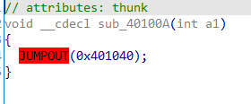

发现`.text:00401084`处的`jnz short $+2`无法达到，因为其上`xor eax, eax`导致ZF为1，其下的`jz`必定执行。故将此花指令改为nop。


查看另一处花指令，此处`xor`导致jz必定执行，同时发现跳转地址比下方代码段的地址加1，说明代码段的真实开始位置是`.text:00401272`，而此地址前的一个字节被错误解析为指令导致了无法反编译，因此找到`.text:00401272`处的字节修改为90（即nop代表的字节）：


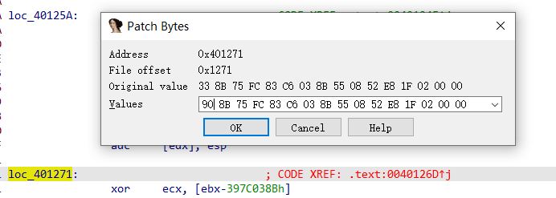

后面还发现下面还有一处同样的花指令，进行同样的修改即可。

`Edit -> Patch Program -> Apply ` patches to input file后，重新打开ida即发现这两处代码可以反编译了。复制整理后如下：

```c
#include <stdio.h>
#include <stdlib.h>
#include <string.h>

char sub_401005(char *a1, char *a2)
{
  char result; // al
  char v3; // [esp+4Ch] [ebp-4h]

  v3 = *a1;
  *a1 = *a2;
  result = v3;
  *a2 = v3;
  return result;
}

size_t step1(char *a1)
{
  size_t result; // eax
  int v2; // [esp+4Ch] [ebp-54h]
  int j; // [esp+50h] [ebp-50h]
  signed int i; // [esp+54h] [ebp-4Ch]
  unsigned int k; // [esp+54h] [ebp-4Ch]
  int v6; // [esp+58h] [ebp-48h]
  char Str[68]; // [esp+5Ch] [ebp-44h] BYREF

  strcpy(Str, "ABCDEFGHIJKLMNOPQRSTUVWXYZabcdefghijklmnopqrstuvwxyz0123456789+/");
  v6 = strlen(Str);     
  for ( i = 0; i < strlen(a1); ++i )
  {
    *((char *)&v6 + v6 + 3) = 123;
    *((char *)&v6 + v6 + 2) = 125;
    for ( j = 0; j < v6; ++j )
    {
      if ( a1[i] == Str[j] )
      {
        v2 = j;
        break;
      }
    }
    a1[i] = Str[(v2 + (i >> 1) * 2 * i) % v6];
  }
  for ( k = 0; ; ++k )
  {
    result = strlen(a1);
    if ( k >= result )
      break;
    if ( a1[k] == 123 )
      a1[k] = 47;
    if ( a1[k] == 125 )
      a1[k] = 43;
  }
  return result;
}

char * step2(char *Str)
{
  size_t v1; // eax
  size_t v2; // eax
  char *result; // eax
  size_t i; // [esp+4Ch] [ebp-4h]
  size_t j; // [esp+4Ch] [ebp-4h]

  for ( i = 0; i < strlen(Str); ++i )
  {
    v1 = strlen(Str);
    sub_401005(&Str[i], &Str[(i + 3) % v1]);
  }
  for ( j = 0; j < strlen(Str); ++j )
  {
    v2 = strlen(Str);
    sub_401005(&Str[j], &Str[(j + 9) % v2]);
  }
  Str[31] = 61;
  result = Str;
  Str[30] = 61;
  Str[32] = 0;
  return result;
}

char str[33] = "your input str";
char *result = "Jew/PwcnwJJsCMMM1qyPZE5iHshiOF==";

int main() {
  step1(str);
  step2(str);
  printf("%s \n", str);
}
```

根据代码写出逆向代码：

```c
#include <stdio.h>
#include <stdlib.h>
#include <string.h>

char sub_401005(char *a1, char *a2)
{
  char result; // al
  char v3; // [esp+4Ch] [ebp-4h]

  v3 = *a1;
  *a1 = *a2;
  result = v3;
  *a2 = v3;
  return result;
}

size_t reverse(char *a1)
{
  size_t result;
  unsigned int k;
  char Str[68];
  signed int i;
  int j;
  int v6;
  int v2;
  
  strcpy(Str, "ABCDEFGHIJKLMNOPQRSTUVWXYZabcdefghijklmnopqrstuvwxyz0123456789+/");
  v6 = strlen(Str); 
  for ( i = 0; i < strlen(a1); ++i ){
    int now;
    for ( j = 0; j < v6; ++j )
    {
      if ( a1[i] == Str[j] )
      {
        now = j;
        break;
      }
    }
    for (int m = 0;m < v6;m ++) {
      if ((m + (i >> 1) * 2 * i) % v6 == now) {
        v2 = m;
        break;
      }
    }
    a1[i] = Str[v2];
  }
  for ( k = 0; ; ++k )
  {
    result = strlen(a1);
    if ( k >= result )
      break;
    if ( a1[k] == 47 )
      a1[k] = 123;
    if ( a1[k] == 43 )
      a1[k] = 125;
  }
  return result;
}

char * reverse2(char *Str)
{
  size_t v1; // eax
  size_t v2; // eax
  char *result; // eax
  int i; // [esp+4Ch] [ebp-4h]
  int j; // [esp+4Ch] [ebp-4h]
  for ( j = strlen(Str) - 1; j >= 0; j-- )
  {
    v2 = strlen(Str);
    sub_401005(&Str[j], &Str[(j + 9) % v2]);
  }
  for ( i = strlen(Str) - 1; i >= 0; i-- )
  {
    v1 = strlen(Str);
    sub_401005(&Str[i], &Str[(i + 3) % v1]);
  }
  
  result = Str;
  return result;
}

char str1[40] = "Jew/PwcnwJJsCMMM1qyPZE5iHshiOF";

int main() {
    reverse2(str1);
    reverse(str1);
    printf("%s \n", str1);
    return 0;
}
```

## [Middle] Shino 的心跳大冒险

打开游戏发现了可爱的CNSS娘挡住了flag，于是想办法让她不要挡住flag即可。

翻了半天发现`YuriConfig.dat`文件里写的是一些布局信息，于是想到把flag输出的文字偏离cnss娘的阻挡范围。

把` YuriConfig.dat`文件的` GameMsgLayerX=>0=>3`改成` GameMsgLayerX=>-300=>3`即可。

## [Easy?] Baby XOR?

😭这就是全栈CTFer的世界吗😭完全不会......

本题含有**Re，Crypto和Misc**的内容。

文件里是一个`virus.exe`和一张`setu_encoded.png`，任务应该就是decode一下这个图片然后得到flag。

把exe放进ida，发现main函数主要逻辑是一个读取原`setu.png`然后对每个字节进行修改最后写入到`setu_encoded.png`里。

```c
int __cdecl main(int argc, const char **argv, const char **envp)
{
  _DWORD *v3; // rax
  FILE *v5; // [rsp+48h] [rbp-28h]
  FILE *Stream; // [rsp+58h] [rbp-18h]
  int j; // [rsp+60h] [rbp-10h]
  int i; // [rsp+6Ch] [rbp-4h]

  _main();
  Stream = fopen("setu.png", "rb");
  fseek(Stream, 0, 0);
  fread(buf, 0xD1EFEui64, 1ui64, Stream);
  fclose(Stream);
  if ( Stream )
  {
    v3 = _cxa_allocate_exception(4ui64);
    *v3 = 1;
    _cxa_throw(v3, refptr__ZTIi, 0i64);
  }
  for ( i = 0; i <= 859901; ++i )
    buf[i] ^= 0x55u;
  for ( j = 0; j <= 859901; ++j )
    buf[j] += 17;
  v5 = fopen("setu_encoded.png", "wb");
  fwrite(buf, 0xD1EFEui64, 1ui64, v5);
  fclose(v5);
  return 0;
}
```

发现如果读到了`setu.png`就会抛出一个异常然后进行某些处理，为了找到相应的处理函数，需要进行异常处理的逆向。

打开ida的流程图，查看main函数的控制流：


发现catch到这个异常后转到了`loc_401C6A`这个位置：


可以跳过异常处理块直接跳转调用这部分代码，在catch处pathc program，将catch操作改为直接跳转至`loc_401C6A`：


重新反编译生成伪代码，可以看到此时的完整加密流程：

```c
int __cdecl main(int argc, const char **argv, const char **envp)
{
  int v3; // ebx
  int v5; // esi
  unsigned __int8 v6[16]; // [rsp+30h] [rbp-40h] BYREF
  unsigned __int8 v7[8]; // [rsp+40h] [rbp-30h] BYREF
  FILE *v8; // [rsp+48h] [rbp-28h]
  FILE *v9; // [rsp+50h] [rbp-20h]
  FILE *Stream; // [rsp+58h] [rbp-18h]
  int j; // [rsp+60h] [rbp-10h]
  int k; // [rsp+64h] [rbp-Ch]
  int v13; // [rsp+68h] [rbp-8h]
  int i; // [rsp+6Ch] [rbp-4h]

  _main();
  Stream = fopen("setu.png", "rb");
  fseek(Stream, 0, 0);
  fread(buf, 0xD1EFEui64, 1ui64, Stream);
  fclose(Stream);
  if ( !Stream )
  {
    for ( i = 0; i <= 859901; ++i )
      buf[i] ^= 0x55u;
LABEL_5:
    for ( j = 0; j <= 859901; ++j )
      buf[j] += 17;
    v8 = fopen("setu_encoded.png", "wb");
    fwrite(buf, 0xD1EFEui64, 1ui64, v8);
    fclose(v8);
    return 0;
  }
  while ( v13 <= 3 )
  {
    if ( v7[v13] > 0x50u )
    {
      puts("Wrong key.");
      v3 = 0;
LABEL_20:
      v5 = 0;
      goto LABEL_21;
    }
    ++v13;
  }
  _Encrypt(buf, v7, 859902);
  fscanf(v9, "%d%d%d%d", v6, &v6[1], &v6[2], &v6[3]);
  for ( k = 0; k <= 3; ++k )
  {
    if ( v6[k] > 0x50u )
    {
      puts("Wrong key.");
      v3 = 0;
      goto LABEL_20;
    }
  }
  _Encrypt(buf, v6, 859902);
  fclose(v9);
  v5 = 1;
LABEL_21:
  _cxa_end_catch();
  if ( v5 == 1 )
    goto LABEL_5;
  return v3;
}
```

发现利用了某两个key来进行了两次`_Encrypt`操作，点进`_Encrypt`函数并整理得到：

```c
long initST(unsigned char *s, unsigned char *k, unsigned char *key, int len)
{
  int i; // [rsp+Ch] [rbp-4h]

  for ( i = 0; i <= 255; ++i )
  {
    s[i] = i;
    k[i] = key[i % len];
  }
  return 0L;
}

long initS(unsigned char *a1, unsigned char *a2)
{
  unsigned char v3; // [rsp+7h] [rbp-9h]
  int v4; // [rsp+8h] [rbp-8h]
  int i; // [rsp+Ch] [rbp-4h]

  v4 = 0;
  for ( i = 0; i <= 255; ++i )
  {
    v4 = (a1[i] + v4 + a2[i]) % 256;
    v3 = a1[v4];
    a1[v4] = a1[i];
    a1[i] = v3;
  }
  return 0L;
}

long initK(unsigned char *a1, unsigned char *a2, int a3)
{
  unsigned char v4; // [rsp+13h] [rbp-Dh]
  int i; // [rsp+14h] [rbp-Ch]
  int v6; // [rsp+18h] [rbp-8h]
  int v7; // [rsp+1Ch] [rbp-4h]

  v7 = 0;
  v6 = 0;
  for ( i = 0; i < a3; ++i )
  {
    v7 = (v7 + 1) % 256;
    v6 = (v6 + a1[v7]) % 256;
    v4 = a1[v6];
    a1[v6] = a1[v7];
    a1[v7] = v4;
    a2[i] = a1[(unsigned char)(a1[v7] + a1[v6])];
  }
  return 0L;
}

long Enc(unsigned char *a1, unsigned char *a2, unsigned char *a3, int a4)
{
  int i; // [rsp+Ch] [rbp-4h]

  for ( i = 0; i < a4; ++i )
    a3[i] = a2[i] ^ a1[i];
  return 0L;
}

long _Encrypt(unsigned char *buf_arg, unsigned char *key_arg, int len)
{
  unsigned char *v3; // rdx
  long result; // rax
  long v5; // [rsp+0h] [rbp-80h] BYREF
  unsigned char s[256]; // [rsp+20h] [rbp-60h] BYREF
  unsigned char k[256]; // [rsp+120h] [rbp+A0h] BYREF
  unsigned char key[256]; // [rsp+220h] [rbp+1A0h] BYREF
  unsigned char v9[256]; // [rsp+320h] [rbp+2A0h] BYREF
  unsigned char v10[256]; // [rsp+420h] [rbp+3A0h] BYREF
  char v11[256]; // [rsp+520h] [rbp+4A0h] BYREF
  int i; // [rsp+62Ch] [rbp+5ACh]

  memset(&v5 + 4, 0, 0x100uL);
  memset(k, 0, sizeof(k));
  memset(key, 0, sizeof(key));
  memset(v10, 0, sizeof(v10));
  memset(v11, 0, sizeof(v11));
  memcpy(key, key_arg, 8uL);
  memcpy(v9, buf_arg, 8uL);
  initST(s, k, key, 4);                         // RC4
  initS(s, k);                                  // RC4
  initK(s, key, 256);    

  for ( i = 0; ; i += 256 )
  {
    result = (unsigned int)(i + 256);
    if ( (int)result >= len )
      break;
    memset(v10, 0, sizeof(v10));
    memcpy(v9, &buf_arg[i], sizeof(v9));
    Enc(key, v9, v10, 256);
    v3 = &buf_arg[i];
    *(long *)v3 = *(long *)v10;
    *((long *)v3 + 31) = *(long *)&v10[248];
    memcpy(
      (void *)((unsigned long)(v3 + 8) & 0xFFFFFFFFFFFFFFF8uL),
      (const void *)(v10 - &v3[-((unsigned long)(v3 + 8) & 0xFFFFFFFFFFFFFFF8uL)]),
      8L * ((((long)v3 - (((long)v3 + 8) & 0xFFFFFFF8) + 256) & 0xFFFFFFF8) >> 3));
  }
  return result;
}
```

查阅`CTF Wiki`可知这是一个标准的RC4加密，RC4是一个对称的流加密算法，加密解密都使用同样的方式，这意味着两次用同样的key进行加密后得到的结果串是不变的。有这个性质就可以不用专门写decrypt代码啦（懒）！

要解密图片，就需要得到加密时的key，而题中所用的key是一个含4个元素的数组，每个元素的范围都是0~79。两个不同的key，要想纯暴力破解key的复杂度为O(n^2)（运行时间可能会有点过于离谱）。

再次查阅`CTF Wiki`可以知道对于两重加密可以使用**Meet in the Middle（中间相遇攻击）**，即知道一对相应的输入和输出时，可以根据其输入P和输出C，分别遍历key，对输入P加密一次，其结果排序并保存。然后再遍历key，对输出C加密一次，并在P加密的结果中查找是否有与当前结果相同的，若找到，则可认为其对应的key1、key2为正确的key。

分析可知，此方法只需要分别进行两次遍历单个key的操作（O(n)），并包含一个查找和排序的操作（O(nlogn)），将原先整体O(n^2)的复杂度降低到了O(nlogn)，这下可以在去世之前跑出来了。

于是写出破解key的函数：

```c
int main() {
    unsigned char buf[8] = {0};
    unsigned char key[16] = {0};
    map<string, unsigned char*> res;//第一次遍历加密的结果
    unsigned char key1[4000] = {0}; //储存key1的所有结果
    unsigned char key2[4000] = {0}; //储存key2的所有结果
    int keyp = 0;//key储存数组的指针
    for (int i = 0; i < 8; i++)
    {
      encoded[i] -= 0x11;
    }
    for (int i = 0; i < 80; i ++ ){
      key[0] = i;
      for (int j = 0;j < 80;j ++) {
        key[1] = j;
        printf("%d,%d\n", i,j);
        for (int k = 0;k < 80;k ++) {
          key[2] = k;
          for (int l = 0;l < 80;l ++) {
            memcpy(buf, origin, 8);
            key[3] = l;
            _Encrypt(buf, key, 9);
            unsigned char* k0 = (unsigned char*)malloc(4);
            memcpy(k0, key, 4);
            string s((char *)buf, 8);
            res[s] = k0;
          }
        }
      }
    }
    memset(key, 0, 4);
    for (int i = 0; i < 80; i ++ ){
      key[0] = i;
      for (int j = 0;j < 80;j ++) {
        key[1] = j;
        printf("%d,%d\n", i,j);
        for (int k = 0;k < 80;k ++) {
          key[2] = k;
          for (int l = 0;l < 80;l ++) {
            memcpy(buf, encoded, 8);
            key[3] = l;
            _Encrypt(buf, key, 9);
            map<string, unsigned char*>::iterator key0 = res.find(string((char*)buf, 8));
            if (key0 != res.end()) {
              printf("\n--------------------\n");
              printf("find key1: \n");
              for (int i = 0; i < 4; i++){
                printf("%d,", res.at(key0->first)[i]);
                key1[keyp + i] = res.at(key0->first)[i];
              }
              printf("\nfind key2:\n%d,%d,%d,%d\n", i,j,k,l);
              key2[keyp] = i;
              key2[keyp + 1] = j;
              key2[keyp + 2] = k;
              key2[keyp + 3] = l;
              keyp += 4;
              printf("\nnow:%d --------------------\n", keyp);
            } 
          }
        }
      }
    }
  for (int i = 0; i < 1000; i+=4)
  {
    printf("\n%d-key1:", i);
    for (int j = 0; j < 4; j++)
    {
      printf("%d,", key1[i + j]);
    }
    printf("/n");
    printf("\n%d-key2:", i);
    for (int j = 0; j < 4; j++)
    {
      printf("%d,", key2[i + j]);
    }
    printf("/n");
  }
  
  return 0;
}
```

使用了c++的map类型来储存第一次加密的所有结果，其自实现的一个排序的map表，可以大大优化查找效率。

由于加密前的图片是**PNG**格式的，所以可以根据PNG的固定格式所需包含的字节来作为输入字节，其内容如下：

```markdown
- （固定）八个字节89 50 4E 47 0D 0A 1A 0A为png的文件头
- （固定）四个字节00 00 00 0D（即为十进制的13）代表数据块的长度为13
- （固定）四个字节49 48 44 52（即为ASCII码的IHDR）是文件头数据块的标示（IDCH）
- （可变）13位数据块（IHDR)
  - 前四个字节代表该图片的宽
  - 后四个字节代表该图片的高
  - 后五个字节依次为：
    Bit depth、ColorType、Compression method、Filter method、Interlace method
- （可变）剩余四字节为该png的CRC检验码，由从IDCH到IHDR的十七位字节进行crc计算得到。
```

于是可以利用固定的字节`89 50 4E 47 0D 0A 1A 0A 00 00 00 0D 49 48 44 52`来作为输入，`setu_encoded.png`的前16个字节作为输出，最后跑出key来，也可以少用字节几个减少内存占用。

最后代入key解密出原图片，flag就在图里：

```c
int main() {
    Stream = fopen("setu_encoded.png", "rb");
    fseek(Stream, 0, 0);
    fread(buf, 0xD1EFEuL, 1uL, Stream);
    fclose(Stream);
    unsigned char key1[16] = {35,31,34,69};
    unsigned char key2[16] = {25,6,19,63};
    for (int k = 0; k <= 859901; ++k ){
        buf[k] -= 17;
    }
    _Encrypt(buf, key2, 859902);
    _Encrypt(buf, key1, 859902);
    
    v5 = fopen("setu.png", "wb");
    fwrite(buf, 0xD1EFEuL, 1uL, v5);
    fclose(v5);
    return 0;
}
```

##  [Hard] Brainfuck++

太顶了这道题，果然还是我太菜了😭做了好久~

开局执行一下exe，效果如下：


拖入ida，搜索字符串，没有搜到`Welcome to the brainfuck++! Plz input the flag`，很奇怪，于是在x64dbg里动调，发现程序显示出`No hacking!`：


应该是程序里有反调试，于是搜索这个字符串，在`BfRuntime.dll`里找到，定位到对应的引用位置的函数：

```c
__int64 sub_62881550()
{
  HANDLE v0; // rax
  BOOL pbDebuggerPresent; // [rsp+24h] [rbp-Ch] BYREF
  HMODULE v3; // [rsp+28h] [rbp-8h]

  v3 = GetModuleHandleA("BfRuntime.dll");
  if ( IsDebuggerPresent()
    || (v0 = GetCurrentProcess(), CheckRemoteDebuggerPresent(v0, &pbDebuggerPresent), pbDebuggerPresent) )
  {
    puts("No hacking!");
    exit(1);
  }
  ((void (*)(void))((char *)v3 + 5067))();
  return 1i64;
}
```

其使用了`IsDebuggerPresent`和`CheckRemoteDebuggerPresent`来判断是否正在调试，在CTF-Wiki里查询相关内容知道`IsDebuggerPresent`这个函数只是单纯地返回了`BeingDebugged`标志的值，其汇编如下：

```assembly
push 60h
pop rsi
gs:lodsq ;Process Environment Block
cmp b [rax+2], 0 ;check BeingDebugged
jne being_debugged
```

而`CheckRemoteDebuggerPresent`可以直接修改`isDebuggerPresent`的值或修改跳转条件来绕过，所以只需要在调试器里打开系统断点，修改`BeingDebugged`的值即可。

但是我想了想，发现这个简单的if判断可以直接把对应处的`jnz`指令改为`jz`即可（不过这样会导致非调试状态下无法正常运行）：

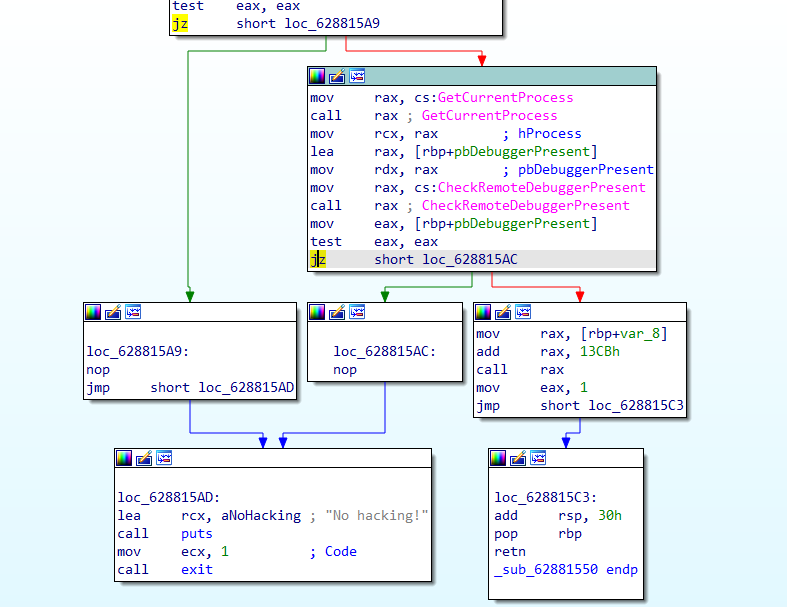


接下来开始调试，首先在字符串里发现了`Wrong`，于是跳到引用位置，下个断点，F9开始运行并调试：


一路跳到`Wrong`的位置，往前回溯一下，发现过程中一个可疑的位置：

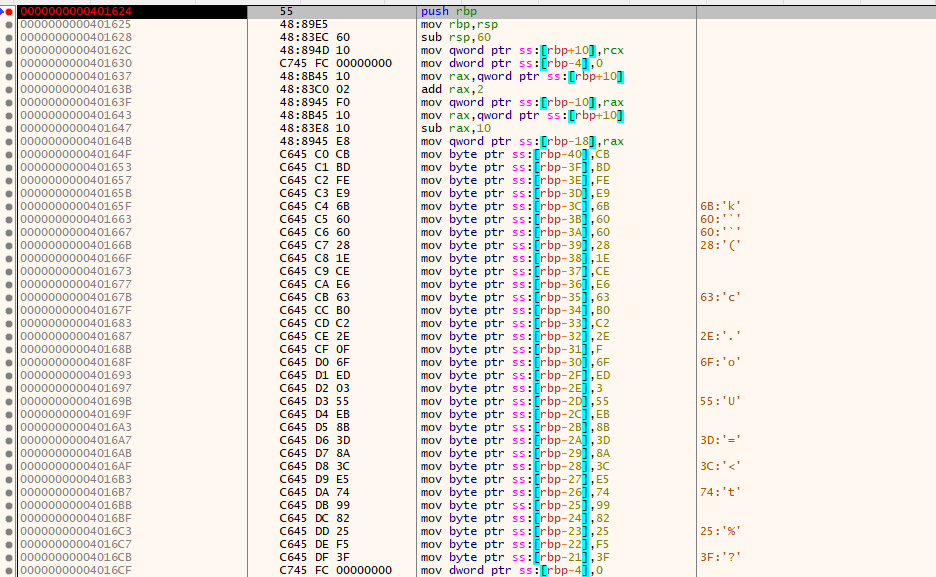

找到其函数函数：`sub_401624`和`sub_401550`：

```c
__int64 __fastcall sub_401624(__int64 a1)
{
  __int64 result; // rax
  char Buf1[40]; // [rsp+20h] [rbp-40h] BYREF
  _DWORD *v3; // [rsp+48h] [rbp-18h]
  __int64 v4; // [rsp+50h] [rbp-10h]
  int i; // [rsp+5Ch] [rbp-4h]

  v4 = a1 + 2;
  v3 = (_DWORD *)(a1 - 16);
  Buf1[0] = -53;
  Buf1[1] = -67;
  Buf1[2] = -2;
  Buf1[3] = -23;
  Buf1[4] = 107;
  Buf1[5] = 96;
  Buf1[6] = 96;
  Buf1[7] = 40;
  Buf1[8] = 30;
  Buf1[9] = -50;
  Buf1[10] = -26;
  Buf1[11] = 99;
  Buf1[12] = -80;
  Buf1[13] = -62;
  Buf1[14] = 46;
  Buf1[15] = 15;
  Buf1[16] = 111;
  Buf1[17] = -19;
  Buf1[18] = 3;
  Buf1[19] = 85;
  Buf1[20] = -21;
  Buf1[21] = -117;
  Buf1[22] = 61;
  Buf1[23] = -118;
  Buf1[24] = 60;
  Buf1[25] = -27;
  Buf1[26] = 116;
  Buf1[27] = -103;
  Buf1[28] = -126;
  Buf1[29] = 37;
  Buf1[30] = -11;
  Buf1[31] = 63;
  for ( i = 0; i <= 3; ++i )
    sub_401550((unsigned int *)(8i64 * i + v4), v3);
  if ( !memcmp(Buf1, (const void *)(a1 + 2), 0x20ui64) )
    result = 4i64;
  else
    result = 3i64;
  return result;
}
```

```c
_DWORD *__fastcall sub_401550(unsigned int *a1, _DWORD *a2)
{
  _DWORD *result; // rax
  unsigned __int64 i; // [rsp+8h] [rbp-18h]
  int v4; // [rsp+14h] [rbp-Ch]
  unsigned int v5; // [rsp+18h] [rbp-8h]
  unsigned int v6; // [rsp+1Ch] [rbp-4h]

  v6 = *a1;
  v5 = a1[1];
  v4 = 0;
  for ( i = 0i64; i <= 0x1F; ++i )
  {
    v4 -= 1640531527;
    v6 += (v5 + v4) ^ (*a2 + 16 * v5) ^ ((v5 >> 5) + a2[1]);
    v5 += (v6 + v4) ^ (a2[2] + 16 * v6) ^ ((v6 >> 5) + a2[3]);
  }
  *a1 = v6;
  result = a1 + 1;
  a1[1] = v5;
  return result;
}
```

感觉有点像对应的判断函数，于是去找其他地方。

根据题目搜了搜Brainfuck，发现这是个极小化的计算机语言，只有8个符号，但是功能很完备。

这是原生的brainfuck：

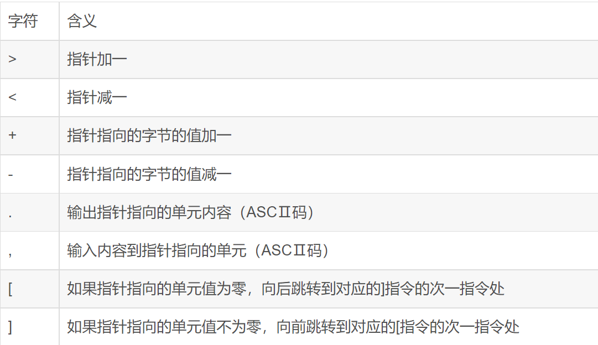

于是ida打开`brainfuck++.exe`发现main函数里就有brainfuck：

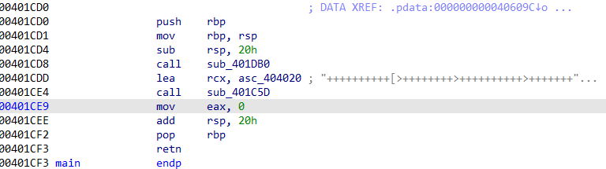

点击查看完整内容：


发现有`!`，猜测可能是自实现了一个brainfuck解释器，于是查看`main`函数，其中传入这段brainfuck并调用了`sub_401C5D`函数：

```c
__int64 __fastcall sub_401C5D(__int64 a1)
{
  unsigned int v2; // [rsp+2Ch] [rbp-4h]

  v2 = sub_401734((const char *)a1);
  if ( !v2 )
    v2 = sub_401A0A();
  if ( v2 == 1 )
  {
    puts("Error!");
    exit(1);
  }
  if ( v2 == 3 )
  {
    puts("Wrong!");
    exit(0);
  }
  puts("Congratulation!");
  return v2;
}
```

据此推测这个函数就是完整输入并判断flag的流程，而`sub_401734`和`sub_401A0A`函数是重点。

查看`sub_401734`发现一个switch判断，且判断条件包含了brainfuck的所有字符以及`!`和`^`，但是前面的brainfuck段里没有发现`^`，推测可能在运行时修改了这段代码，不过可以确定的是：`sub_401734`是这个brianfuck++解释器的一部分，将brainfuck符号转化为数字指令：

```c
__int64 __fastcall sub_401734(const char *a1)
{
  int v2; // eax
  unsigned __int16 v3; // [rsp+26h] [rbp-5Ah]
  int v4; // [rsp+28h] [rbp-58h]
  unsigned __int16 v5; // [rsp+2Ch] [rbp-54h]
  unsigned __int16 v6; // [rsp+2Eh] [rbp-52h]

  v6 = 0;
  v5 = 0;
  while ( 1 )
  {
    v4 = a1[v5];
    if ( !a1[v5] || v6 >= strlen(a1) )
      break;
    switch ( v4 )
    {
      case '!':
        *((_WORD *)&unk_408040 + 2 * v6) = 10;
        goto LABEL_18;
      case '+':
        *((_WORD *)&unk_408040 + 2 * v6) = 3;
        goto LABEL_18;
      case ',':
        *((_WORD *)&unk_408040 + 2 * v6) = 6;
        goto LABEL_18;
      case '-':
        *((_WORD *)&unk_408040 + 2 * v6) = 4;
        goto LABEL_18;
      case '.':
        *((_WORD *)&unk_408040 + 2 * v6) = 5;
        goto LABEL_18;
      case '<':
        *((_WORD *)&unk_408040 + 2 * v6) = 2;
        goto LABEL_18;
      case '>':
        *((_WORD *)&unk_408040 + 2 * v6) = 1;
        goto LABEL_18;
      case '[':
        *((_WORD *)&unk_408040 + 2 * v6) = 7;
        if ( dword_40C440 == 512 )
          return 1i64;
        v2 = dword_40C440++;
        word_40C040[v2] = v6;
        goto LABEL_18;
      case ']':
        if ( !dword_40C440 )
          return 1i64;
        v3 = word_40C040[--dword_40C440];
        *((_WORD *)&unk_408040 + 2 * v6) = 8;
        word_408042[2 * v6] = v3;
        word_408042[2 * v3] = v6;
LABEL_18:
        ++v6;
        ++v5;
        break;
      case '^':
        *((_WORD *)&unk_408040 + 2 * v6) = 9;
        goto LABEL_18;
      default:
        --v6;
        goto LABEL_18;
    }
  }
  if ( dword_40C440 || v6 == 4096 )
    return 1i64;
  *((_WORD *)&unk_408040 + 2 * v6) = 0;
  return 0i64;
}
```

再观察`sub_401A0A`函数，可以发现其功能是执行前面翻译过来的数字指令：

```c
__int64 sub_401A0A()
{
  char v1[10544]; // [rsp+20h] [rbp-60h] BYREF
  HMODULE v2; // [rsp+2950h] [rbp+28D0h]
  unsigned int v3; // [rsp+2958h] [rbp+28D8h]
  unsigned int v4; // [rsp+295Ch] [rbp+28DCh]

  v4 = 10535;
  v3 = 0;
  while ( --v4 )
    v1[v4] = 0;
  while ( 2 )
  {
    if ( *((_WORD *)&unk_408040 + 2 * v3) && v4 <= 0x2926 )
    {
      switch ( *((_WORD *)&unk_408040 + 2 * v3) )
      {
        case 1:
          ++v4;
          goto LABEL_19;
        case 2:
          --v4;
          goto LABEL_19;
        case 3:
          ++v1[v4];
          goto LABEL_19;
        case 4:
          --v1[v4];
          goto LABEL_19;
        case 5:
          putchar((unsigned __int8)v1[v4]);
          goto LABEL_19;
        case 6:
          v1[v4] = getchar();
          goto LABEL_19;
        case 7:
          if ( !v1[v4] )
            v3 = word_408042[2 * v3];
          goto LABEL_19;
        case 8:
          if ( v1[v4] )
            v3 = word_408042[2 * v3];
          goto LABEL_19;
        case 9:
          v1[v4] ^= v1[v4 + 1];
LABEL_19:
          ++v3;
          continue;
        case 0xA:
          v2 = GetModuleHandleA(0i64);
          return ((__int64 (__fastcall *)(char *))((char *)v2 + *(__int16 *)&v1[v4]))(&v1[v4]);
        default:
          return 1i64;
      }
    }
    return v4 == 10535;
  }
}
```

结合两函数可以知道，原生brainfuck符号的功能是不变的，而`^`表示当前指针处元素与地址下一个元素进行异或后赋值给自己，`!`表示branfuck段截止，进入某个函数继续进行下一步判断。

在前面得到了`sub_401624`里发现有返回3L和4L的情况，与`main`函数的v2对应，因此可以得知这个大概是判断函数的最后一环。

回到brainfuck，在动调的过程中查看原先存brainfuck的地址，发现其最后部分发生一定变化：

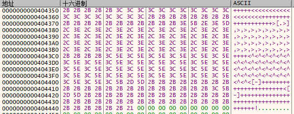

复制下来，根据brainfuck的解释函数得知，整段brainfuck的作用是输出`Welcome to the brainfuck++! Plz input the flag`，然后获取一段长为32的字符串作为输入flag，对其进行了一系列操作处理后在`!`处传入`sub_401624`函数进行判断。于是按照vm的方法来反向写brainfuck解释器。判断函数里有一个tea算法，可以简单逆一下。

最后写出的逆向代码为：

```c
#include <stdio.h>
#include <stdlib.h>
#include <string.h>

char brainfuck[] = "++++++++++[>++++++++>++++++++++>++++++++++>+++++++++>+++++++++++>++++++++++>++++++++++>+++>+++++++++++>+++++++++++>+++>+++++++++++>++++++++++>++++++++++>+++>+++++++++>+++++++++++>+++++++++>++++++++++>+++++++++++>++++++++++>+++++++++++>+++++++++>++++++++++>++++>++++>+++>+<<<<<<<<<<<<<<<<<<<<<<<<<<<<-]>+++++++>+>++++++++>+++++++++>+>+++++++++>+>++>++++++>+>++>++++++>++++>+>++>++++++++>++++>+++++++>+++++>>++>+++++++>+++++++++>+++++++>+++>+++>+++><<<<<<<<<<<<<<<<<<<<<<<<<<<<++++++++++++++++++++++++++++>[.>]++++++++++[>++++++++>++++++++++>++++++++++++>+++>++++++++++>+++++++++++>+++++++++++>+++++++++++>+++++++++++>+++>+++++++++++>++++++++++>++++++++++>+++>++++++++++>++++++++++>+++++++++>++++++++++>+++++<<<<<<<<<<<<<<<<<<<-]>>++++++++>++>++>+++++>>++>+++++++>++++++>++>++++++>++++>+>++>++>++++++++>+++++++>+++>++++++++<<<<<<<<<<<<<<<<<<<+++++++++++++++++++>[.>],>,>,>,>,>,>,>,>,>,>,>,>,>,>,>,>,>,>,>,>,>,>,>,>,>,>,>,>,>,>,>,>++++<^<^<^<^<^<^<^<^<^<^<^<^<^<^<^<^<^<^<^<^<^<^<^<^<^<^<^<^<^<^<^<^<[-]++++++++++++++++++++++<[-]++++++++++++++++++++++++++++++++++++!";
int instruction[1064];
int dword_40C440;
unsigned int word_408042[8191];
short word_40C040[512];
char input[] = "cnss{abcdefghijklm2i_!ikcjc_jo9}";//随便输的，只是为了满足输入要求

// 翻译brainfuck为数字指令
long translate(const char *a1)
{
  int v2; // eax
  unsigned short v3; // [rsp+26h] [rbp-5Ah]
  unsigned int v4; // [rsp+28h] [rbp-58h]
  unsigned short v5; // [rsp+2Ch] [rbp-54h]
  unsigned short v6; // [rsp+2Eh] [rbp-52h]

  v6 = 0;
  v5 = 0;
  while ( 1 )
  {
    v4 = a1[v5];
    if ( !a1[v5] || v6 >= strlen(a1) )
      break;
    switch ( v4 )
    {
      case '!':
        *((short *)&instruction + 2 * v6) = 10;
        goto LABEL_18;
      case '+':
        *((short *)&instruction + 2 * v6) = 3;
        goto LABEL_18;
      case ',':
        *((short *)&instruction + 2 * v6) = 6;
        goto LABEL_18;
      case '-':
        *((short *)&instruction + 2 * v6) = 4;
        goto LABEL_18;
      case '.':
        *((short *)&instruction + 2 * v6) = 5;
        goto LABEL_18;
      case '<':
        *((short *)&instruction + 2 * v6) = 2;
        goto LABEL_18;
      case '>':
        *((short *)&instruction + 2 * v6) = 1;
        goto LABEL_18;
      case '[':
        *((short *)&instruction + 2 * v6) = 7;
        if ( dword_40C440 == 512 )
          return 1L;
        v2 = dword_40C440++;
        word_40C040[v2] = v6;
        goto LABEL_18;
      case ']':
        if ( !dword_40C440 )
          return 1L;
        v3 = word_40C040[--dword_40C440];
        *((short *)&instruction + 2 * v6) = 8;
        word_408042[2 * v6] = v3;
        word_408042[2 * v3] = v6;
LABEL_18:
        ++v6;
        ++v5;
        break;
      case '^':
        *((short *)&instruction + 2 * v6) = 9;
        goto LABEL_18;
      default:
        --v6;
        goto LABEL_18;
    }
  }
  if ( dword_40C440 || v6 == 4096 )
    return 1L;
  *((short *)&instruction + 2 * v6) = 0;
  return 0L;
}

char v1[10544];
//先让brainfuck正常运行以填充v1
long vm()
{
   // [rsp+20h] [rbp-60h] BYREF
  unsigned int v3; // [rsp+2958h] [rbp+28D8h]
  unsigned int v4; // [rsp+295Ch] [rbp+28DCh]
  
  v4 = 10535;
  v3 = 0;
  
  while ( --v4 )
    v1[v4] = 0;
  while ( 2 )
  {
    // v4 <= 10534
    if ( *((short *)&instruction + 2 * v3) && v4 <= 0x2926 )
    {
      switch ( *((short *)&instruction + 2 * v3) )
      {
        case 1:
          ++v4;
          goto LABEL_19;
        case 2:
          --v4;
          goto LABEL_19;
        case 3:
          ++v1[v4];
          goto LABEL_19;
        case 4:
          --v1[v4];
          goto LABEL_19;
        case 5:
          // putchar((unsigned char)v1[v4]);
          goto LABEL_19;
        case 6:
          v1[v4] = input[v4 -49];
          goto LABEL_19;
        case 7:
          if ( !v1[v4] )
            v3 = word_408042[2 * v3];
          goto LABEL_19;
        case 8:
          if ( v1[v4] )
            v3 = word_408042[2 * v3];
          goto LABEL_19;
        case 9:
          v1[v4] ^= v1[v4 + 1];
LABEL_19:
          ++v3;
          continue;
        case 0xA:
          return 10L;
        default:
          return 1L;
      }
    }
    printf("v4: %d", v4);
    return v4 == 10535;
  }
}

int * re2(unsigned int *a1, int *a2)
{
  int *result; // rax
  unsigned long i; // [rsp+8h] [rbp-18h]
  int v4 = -957401312; // [rsp+14h] [rbp-Ch]
  unsigned int v5; // [rsp+18h] [rbp-8h]
  unsigned int v6; // [rsp+1Ch] [rbp-4h]

  v6 = *a1;
  v5 = a1[1];
  for ( i = 0L; i <= 0x1F; ++i )
  {
    v5 -= (v6 + v4) ^ (a2[2] + 16 * v6) ^ ((v6 >> 5) + a2[3]);
    v6 -= (v5 + v4) ^ (*a2 + 16 * v5) ^ ((v5 >> 5) + a2[1]);
    v4 += 1640531527;
  }
  *a1 = v6;
  result = a1 + 1;
  a1[1] = v5;
  return result;
}

long re1(int* k)
{
  long result; // rax
  int *v3; // [rsp+48h] [rbp-18h]
  char Buf1[40];
  long v4; // [rsp+50h] [rbp-10h]
  int i; // [rsp+5Ch] [rbp-4h]

  Buf1[0] = -53;
  Buf1[1] = -67;
  Buf1[2] = -2;
  Buf1[3] = -23;
  Buf1[4] = 107;
  Buf1[5] = 96;
  Buf1[6] = 96;
  Buf1[7] = 40;
  Buf1[8] = 30;
  Buf1[9] = -50;
  Buf1[10] = -26;
  Buf1[11] = 99;
  Buf1[12] = -80;
  Buf1[13] = -62;
  Buf1[14] = 46;
  Buf1[15] = 15;
  Buf1[16] = 111;
  Buf1[17] = -19;
  Buf1[18] = 3;
  Buf1[19] = 85;
  Buf1[20] = -21;
  Buf1[21] = -117;
  Buf1[22] = 61;
  Buf1[23] = -118;
  Buf1[24] = 60;
  Buf1[25] = -27;
  Buf1[26] = 116;
  Buf1[27] = -103;
  Buf1[28] = -126;
  Buf1[29] = 37;
  Buf1[30] = -11;
  Buf1[31] = 63;
  v4 = (long) Buf1;
  for ( i = 0; i <= 3; ++i )
    re2((unsigned int *)(8L * i + v4), k);
  for (int i = 0;i < 32; i ++) {
    v1[i + 49] = Buf1[i];
  }
  return result;
}

long vm_re()
{
  
  unsigned int v3; // [rsp+2958h] [rbp+28D8h]
  unsigned int v4; // [rsp+295Ch] [rbp+28DCh]
  char v0[10544];
  strcpy(v0, v1);
  v4 = 47;
  v3 = 1062;
  while ( 2 )
  {
    // v4 <= 10534
    if (*((short *)&instruction + 2 * v3) && v4 <= 0x2926 )
    {
      switch ( *((short *)&instruction + 2 * v3) )
      {
        case 1:
          --v4;
          goto LABEL_19;
        case 2:
          ++v4;
          goto LABEL_19;
        case 3:
          --v1[v4];
          --v0[v4];
          goto LABEL_19;
        case 4:
          ++v1[v4];
          ++v0[v4];
          goto LABEL_19;
        case 5:
          goto LABEL_19;
        case 6:
          return 1L;
        case 7:
          if ( v1[v4] )
            v3 = word_408042[2 * v3];
          goto LABEL_19;
        case 8:
          if ( !v1[v4] )
            v3 = word_408042[2 * v3];
          goto LABEL_19;
        case 9:
          v1[v4] ^= v1[v4 + 1];
          v0[v4] ^= v0[v4 + 1];
LABEL_19:
          --v3;
          continue;
        case 0xA:
          goto LABEL_19;
        default:
          return 1L;
      }
    }
    return v4 == 0;
  }
}

int main() {
    translate(brainfuck);
    vm();
    re1((int*)key[47 - 16]);
    vm_re();
    //输出flag
    for (int i = 49;i < 82; i ++) {
      printf("%c", v1[i]);
    }
    printf("\n");
    return 0;
}
```

## [BOSS] Crazy Hacker


## [Real World] 互联网海盗

- 参考资料：https://www.bilibili.com/read/cv12137533

首先点击翻译并抓包，得到表单格式和url，并拉到`postman`里进行测试。


经过尝试发现不同的单词翻译起来，`token`都保持不变，推测其为固定值，直接复制。多次尝试同样发现headers部分需要附带上对应的`Cookie`和`Acs-Token`，且这两个头部可以固定不变。


于是在控制台源代码里搜索`sign:`，找到一个格式极其相似的地方，在这里下断点：


回到百度翻译，重新输入内容进行翻译，发现的确在此暂停，于是单步进入，找到对应的sign函数：

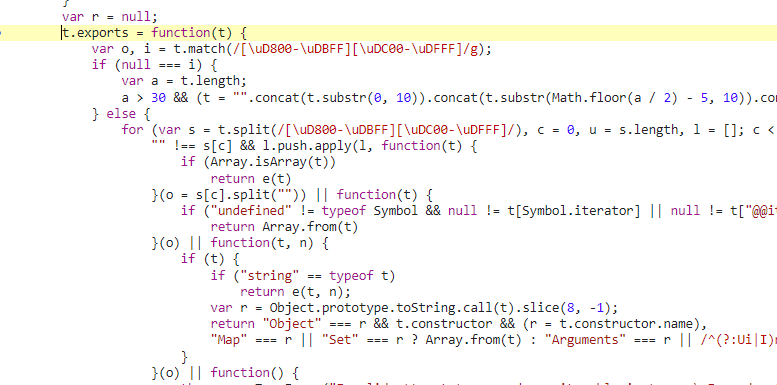

可以选择直接调用js代码的函数而无需专门编写一个sign函数，于是复制此源代码到一个文件。分析发现其使用webpack的方式引入函数，没有直接暴露函数接口，因此对其进行微小修改：


 在源代码中找到sign函数，发现其处于对象的`1117`字段：


直接尝试用`nodejs`运行此函数`funcs[1117]('test')`，发现报错。找到其错误的一行：


将`t.exports = function(t){`和`}`删掉，使其直接运行内部的代码。


再次运行报错：


因为是在`nodejs`环境，没有window对象，所以直接在浏览器调试得到window内容并复制进来。在控制台监听`window`和`d`，重新翻译并单步运行，直到得到两者的值：


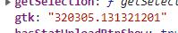

将其替换到对应的`window[d]`，再次运行发现成功：

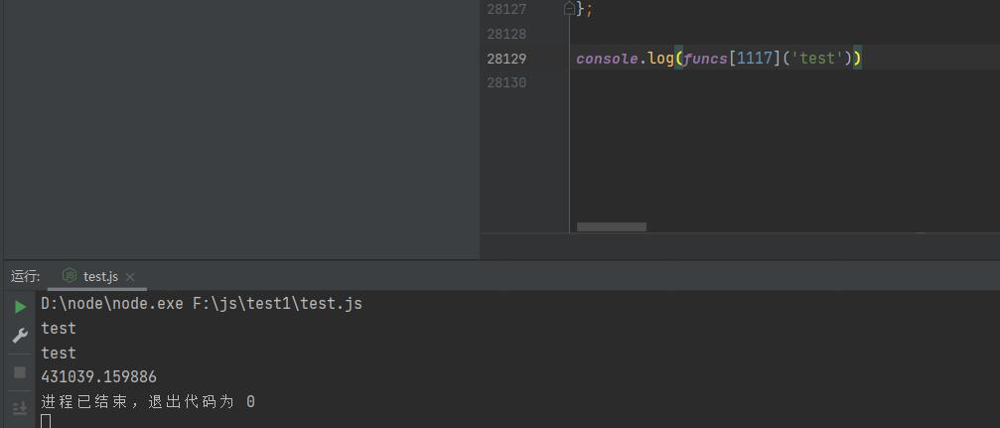

于是可以修改代码使其成为一个`node module` ，这样就可以直接调用其函数：


创建一个新的js文件来发送请求，引入此函数：

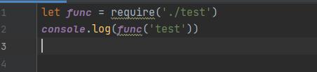

最终使用node的`axios`库来发送请求：


