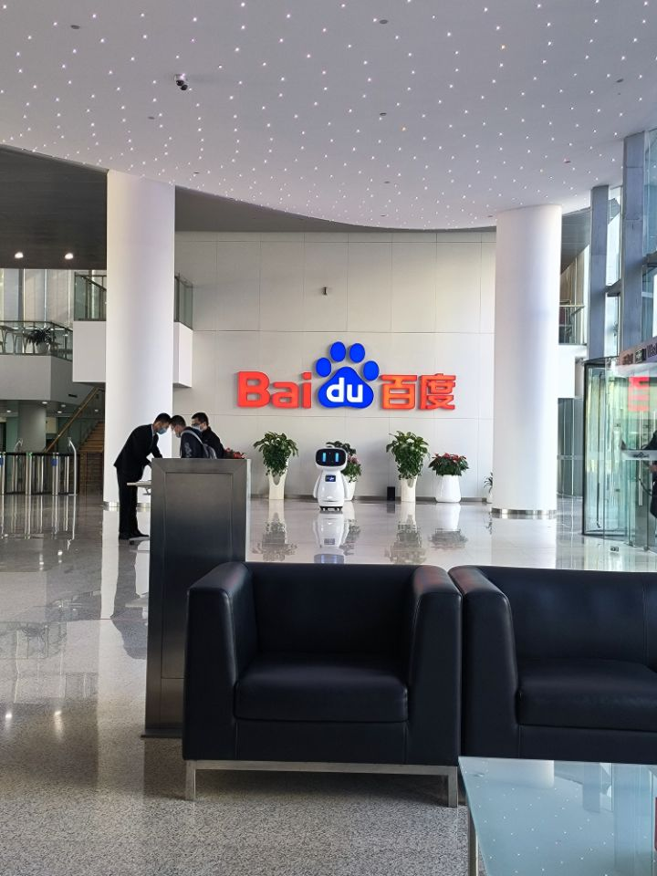
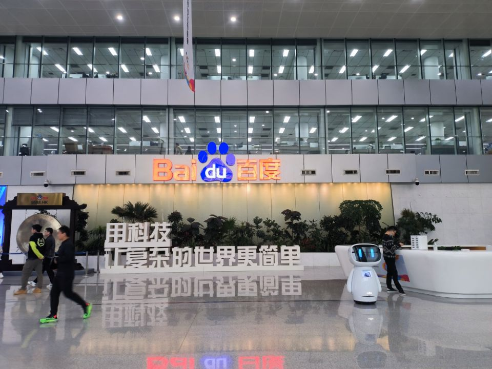
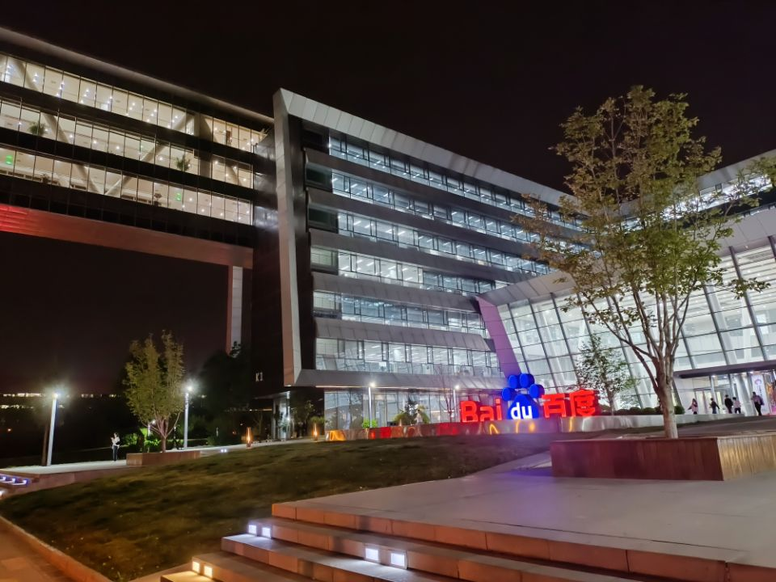
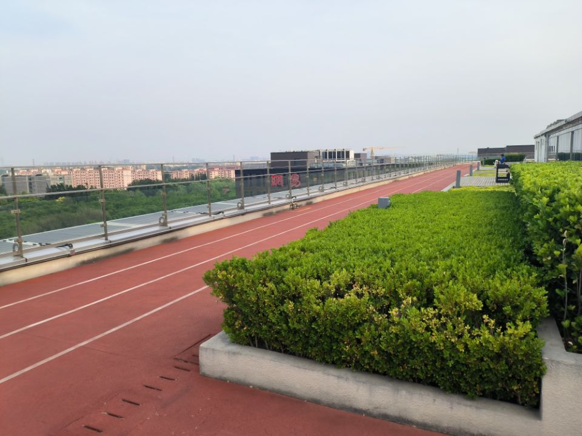
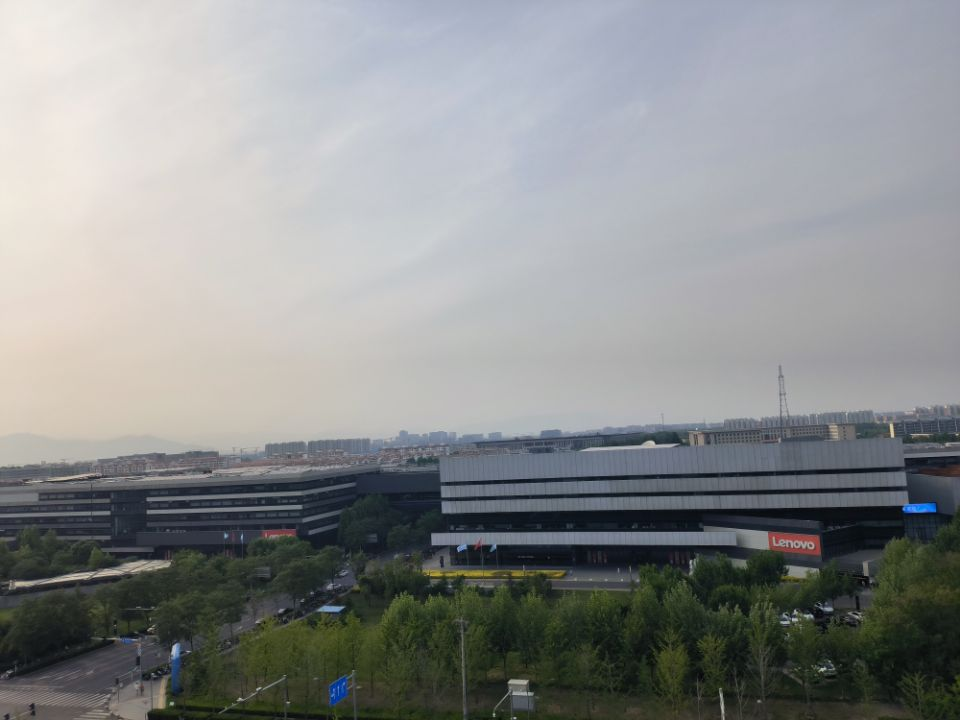
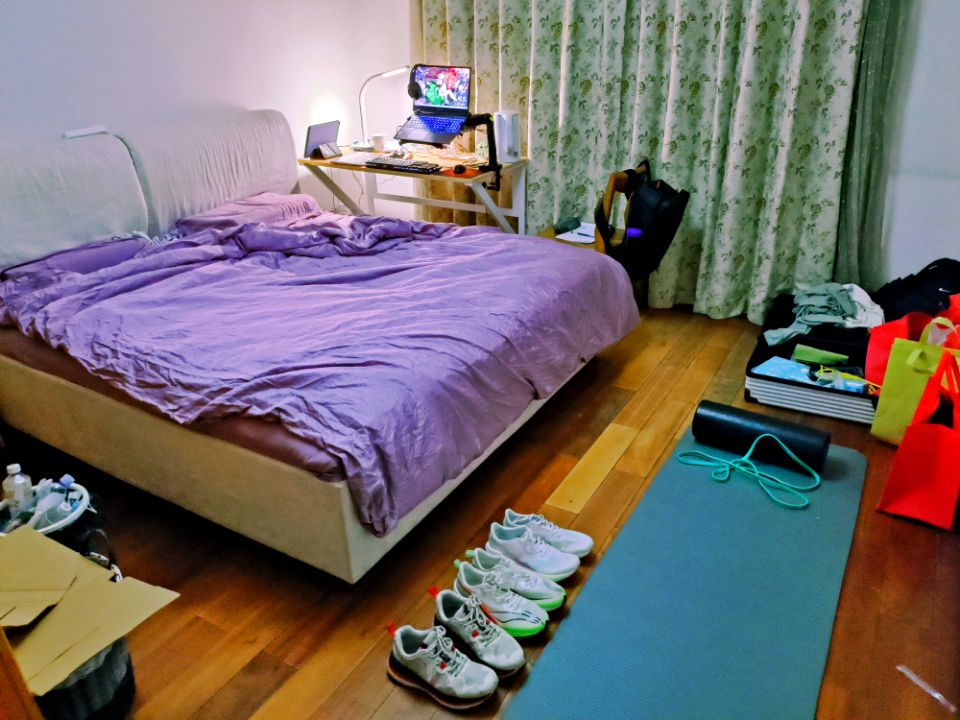
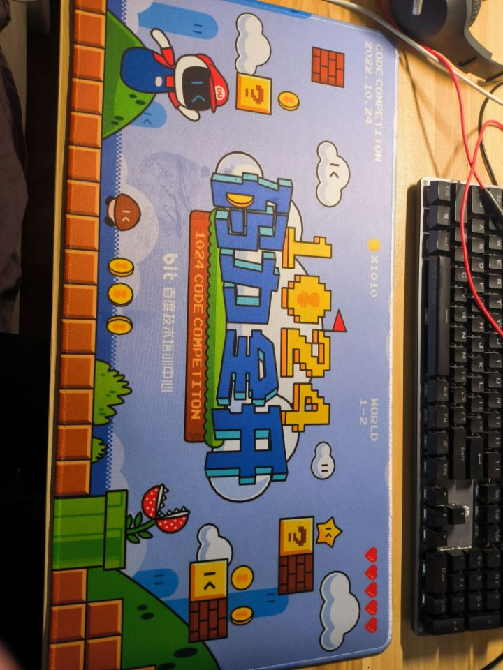

大二就溜去北京实习了，第一次正式的工作，感觉还是挺新奇的，就在博客小小记录一下。

4月26号早上入职，一大早就赶着西二旗的早高峰赶到百度大厦（工作地点实际在百度科技园，大厦只是入职来看了一眼），结果发现还没开门🥲。

等到开始入职拿到了公司发的2020款MacBook pro还很欣喜，结果发现是i5款的不是m1😭罢了，勉强能用。

然后十点过差不多到了正常上班的时候被入职的负责姐姐带着做班车到了百度科技园（真滴挺大），来到部门所在楼层，最好玩的是leader给我找了个部门最边上的工位，这下摸鱼也没人看得到啦！

入职当天啥也没干，就搁那儿配环境和看文档，晚上吃完饭去2号楼逛了一下，发现了公司的快速下班通道🤣：

然后拍了拍咱1号楼的夜景：

不得不说，公司的楼还是挺好看的。科技园在中关村软件园区，附近还有腾讯、联想、新浪和网易等公司，在公司楼顶就看到隔壁的网易楼：

北京的房价和物价都好高😨，回龙观地铁站（五环外）旁边租房2500/月只能租一个10平米卧室然后和5个室友共享公共区域，而且还是个老破小。

平时吃饭一顿平均二十几块钱，一碗牛肉面都要25，公司食堂要便宜几块钱，一天大概四五十块钱用来吃饭吧，恩格尔系数极高。不过公司有免费的早餐和夜宵，只是只有早上九点半之前和晚上8点以后才有😭。

每天上班就是9点起床，大概9点半到班车站点，坐公司班车40分钟去公司，每天通勤大概1个半小时，感觉还是挺累的。不过每天在公司还是挺摸鱼的，十点半左右上班，摸一个小时鱼到十一点半食堂开饭，去吃个饭然后就回工位睡午觉。睡到2点起来继续摸鱼或者干活，干到5点半就去吃晚饭，吃完晚饭如果没有没做完的工作的话就可以下班哩。Baidu不愧是大厂养老院🤣

公司的福利还是不错的，时不时送点小礼品，比如这个律师函警告的鼠标垫：

实习生请假也挺随意的，和leader说一声就行，5月我还请了一天假去跑马拉松😝只不过请假没钱罢了。

总体来说Baidu的实习体验还是不错的，暑假继续干干看看下半年能不能跳槽🤪